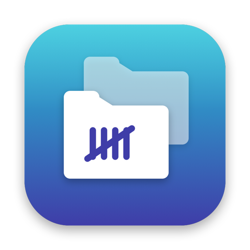
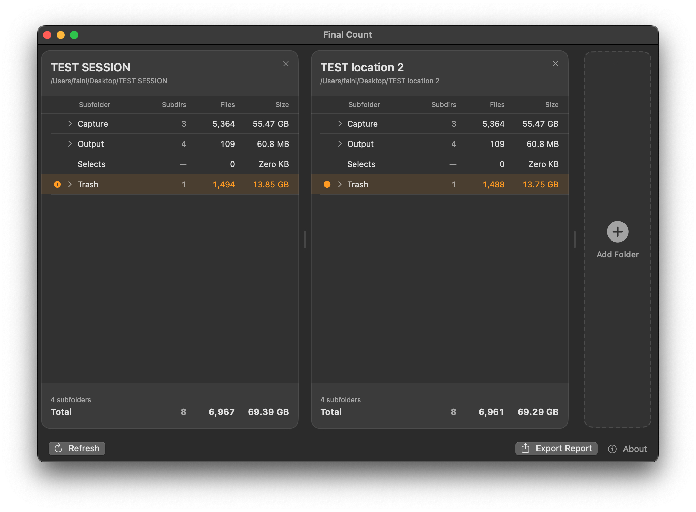

  

<h1 align="center">Final Count</h1>

  A clean, simple macOS app for comparing folders side by side. 
  Verify that multiple drive locations or backups are truly identical. No more relying on "Get Info" for comparison.

  
  
  
  

  

---

## Why Final Count?

Verifying that a folder copied correctly usually means selecting each subfolder, hitting **⌘ I**, and squinting at file counts and sizes one at a time. Final Count replaces that tedium: drop two (or more) folders into side-by-side columns and instantly see every subfolder's count, file count, and total size — with any mismatches highlighted automatically.

It's built for photographers, Digi-tehs, DITs, editors, and anyone who keeps mirrored backups and needs a fast, no-fuss way to confirm two locations match.

---

## Features

- **Side-by-side columns** — compare two or more folders at once
- **Per-subfolder breakdown** — subdirectory count, file count, and total size for each
- **Automatic mismatch detection** — differing subfolders flagged in orange, missing ones in red
- **Expandable rows** — click into any subfolder to inspect its nested contents
- **Drag & drop** — drop a folder onto any column, or onto the Add Folder area to add a new one
- **Resizable columns** — drag the dividers to fit long folder names
- **One-click refresh** — re-scan every folder after making changes
- **Export report** — save a plain-text report verifying whether all locations are identical
- **Clean, native interface** — follows macOS light/dark mode, nothing to configure

---

## How to Get It

### Download the latest release

The easiest way to get started is to download the pre-built app directly from the [Releases](../../releases/latest) page. No Xcode required.

1. Download `Final Count.zip` from the latest release
2. Unzip and move `Final Count.app` to your Applications folder
3. Launch it

### First Launch

Since Final Count is not distributed through the App Store, macOS may block it on first launch. If that happens:

1. Go to **System Settings → Privacy & Security**
2. Scroll down and click **Open Anyway** next to the Final Count message
3. You'll only need to do this once

When you pick a folder for the first time, macOS will ask if Final Count can access it. Click **Allow**. That's the only permission it needs — no Full Disk Access required.

### Build from source

Requires macOS 14.0+ and Xcode 15+.

1. Clone the repo
2. Open `Final Count.xcodeproj` in Xcode
3. Set your development team in **Signing & Capabilities**
4. Build & Run (`⌘R`)

---

## How to Use

1. **Add folders** — drop a folder onto a column, click **Browse**, or use the **+ Add Folder** area on the right
2. **Read the breakdown** — each row shows a subfolder's subdirectory count, file count, and size; the footer totals everything up
3. **Spot differences** — when comparing two or more folders, mismatched subfolders are tinted orange and missing ones red
4. **Dig deeper** — click the chevron beside any subfolder to expand its nested folders
5. **Refresh** — made changes on disk? Hit **Refresh** to re-scan all folders
6. **Export** — click **Export Report** to save a `.txt` summary confirming whether the locations are identical

---

## License

Final Count is licensed under the [GNU General Public License v3.0](https://www.gnu.org/licenses/gpl-3.0.en.html). You're free to use, study, share, and modify it — derivative works must also be released under the GPL. See the [LICENSE](LICENSE) file for the full text.

---

## Support

If you find Final Count useful, consider supporting development:

  
  
  &nbsp;
  
  &nbsp;

---

  By <a href="https://www.fainimade.com">FAINI MADE</a>

