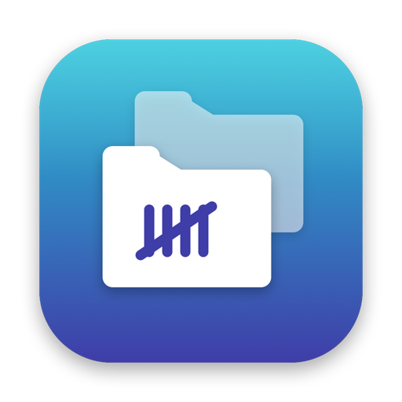
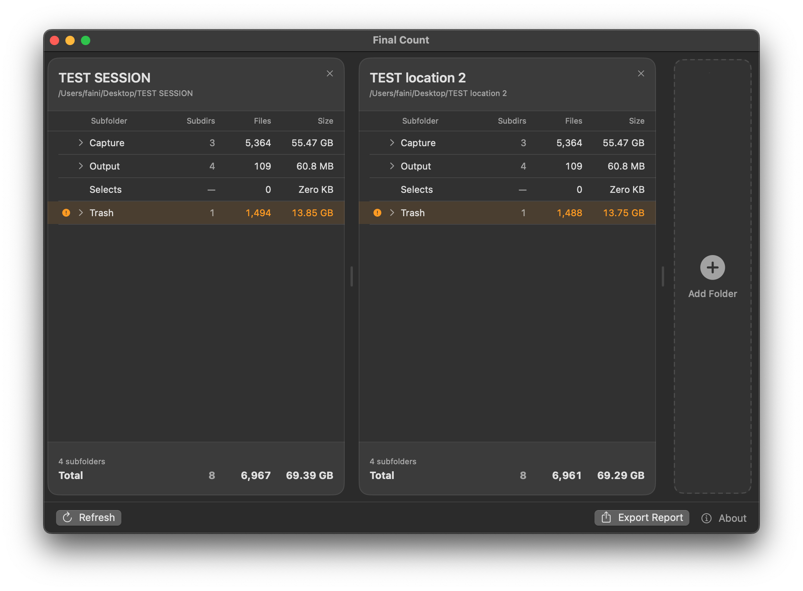

  

<h1 align="center">Final Count</h1>

  A clean, simple macOS app for comparing folders side by side. 
  Verify that multiple drive locations or backups are truly identical. No more relying on "Get Info" for comparison.

  
  
  
  

  

---

## Why Final Count?

Verifying that a folder copied correctly usually means selecting each subfolder, hitting **⌘ I**, and squinting at file counts and sizes one at a time. Final Count replaces that tedium: drop two (or more) folders into side-by-side columns and instantly see every subfolder's count, file count, and total size — with any mismatches highlighted automatically.

It's built for photographers, Digi-tehs, DITs, editors, and anyone who keeps mirrored backups and needs a fast, no-fuss way to confirm two locations match.

---

## Features

- **Side-by-side columns** — compare two or more folders at once
- **Per-subfolder breakdown** — subdirectory count, file count, and total size for each
- **Automatic mismatch detection** — differing subfolders flagged in orange, missing ones in red
- **Catches renamed and moved files** — folders are compared on file names and folder layout as well as file counts and sizes, so two folders with the same totals but different contents still get flagged
- **Same-folder warning** — if two columns point to the same folder on disk (even through an alias, symlink, or a different path), Final Count warns you instead of calling it a match; it also notes when two copies sit on the same drive
- **Show only differences** — hide every subfolder that matches so the problems stand out
- **Expandable rows** — click into any subfolder to inspect its nested contents; all columns expand together and nested folders carry the same mismatch flags, so you can drill straight to the folder that differs
- **Drag & drop** — drop a folder onto any column, or onto the Add Folder area to add a new one
- **Resizable columns** — drag the dividers to fit long folder names
- **Quiet update check** — looks for a newer release at launch (at most once a day) and just swaps the About label to "Update available"; no popups. Turn it off in About
- **One-click refresh** — re-scan every folder after making changes
- **Export report** — save a plain-text report verifying whether all locations are identical, listing every difference down to the exact folder and file names
- **Ignore patterns** — leave files and folders with certain names out of the comparison (`.DS_Store`, a Capture One `Cache` folder, `*.tmp`, and so on). Choose from presets or add your own names with `*` / `?` wildcards. Off by default, and anything skipped is called out in the status banner and the exported report so a match never looks stricter than it is
- **Hidden files option** — include dot-files in the counts when you need them (skipped by default)
- **Keyboard shortcuts** — ⌘O add a folder, ⌘R refresh, ⌘E export, ⇧⌘D show only differences, ⇧⌘. hidden files
- **Clean, native interface** — follows macOS light/dark mode, nothing to configure

---

## How to Get It

### Download the latest release

The easiest way to get started is to download the pre-built app directly from the [Releases](../../releases/latest) page. No Xcode required.

1. Download `Final Count.zip` from the latest release
2. Unzip and move `Final Count.app` to your Applications folder
3. Launch it

### First Launch

Since Final Count is not distributed through the App Store, macOS may block it on first launch. If that happens:

1. Go to **System Settings → Privacy & Security**
2. Scroll down and click **Open Anyway** next to the Final Count message
3. You'll only need to do this once

When you pick a folder for the first time, macOS will ask if Final Count can access it. Click **Allow**. That's the only permission it needs — no Full Disk Access required.

### Build from source

Requires macOS 14.0+ and Xcode 15+.

1. Clone the repo
2. Open `Final Count.xcodeproj` in Xcode
3. Set your development team in **Signing & Capabilities**
4. Build & Run (`⌘R`)

---

## How to Use

1. **Add folders** — drop a folder onto a column, click **Browse**, or use the **+ Add Folder** area on the right
2. **Read the breakdown** — each row shows a subfolder's subdirectory count, file count, and size; the footer totals everything up
3. **Spot differences** — when comparing two or more folders, mismatched subfolders are tinted orange and missing ones red; tick **Only Differences** to hide everything that matches
4. **Dig deeper** — click the chevron beside any subfolder to expand its nested folders; the mismatch flags follow you down, level by level, to the exact folder that differs
5. **Ignore noise** — click **Ignore** to skip files like `.DS_Store` or cache folders you don't want counted; the status banner always shows what was left out
6. **Refresh** — made changes on disk? Hit **Refresh** to re-scan all folders
7. **Export** — click **Export Report** to save a `.txt` summary confirming whether the locations are identical; any differences are traced down to the exact folders and files

### What "identical" means

Final Count compares **file names, folder layout, file counts, and file sizes** at every level (minus any names you've chosen to ignore). That catches missing, extra, renamed, moved, and truncated files. It does **not** read or checksum file contents, so a file that was corrupted without changing size would not be detected.

---

## License

Final Count is licensed under the [GNU General Public License v3.0](https://www.gnu.org/licenses/gpl-3.0.en.html). You're free to use, study, share, and modify it — derivative works must also be released under the GPL. See the [LICENSE](LICENSE) file for the full text.

---

## Support

If you find Final Count useful, consider supporting development:

  
  
  &nbsp;
  
  &nbsp;

---

  By <a href="https://www.fainimade.com">FAINI MADE</a>

